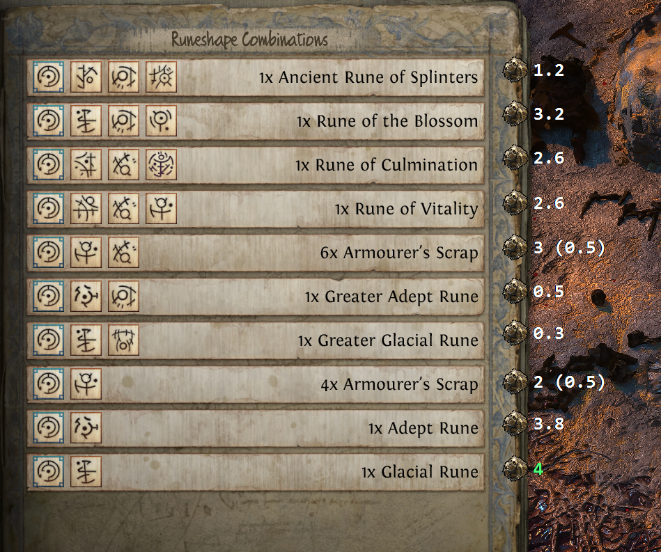
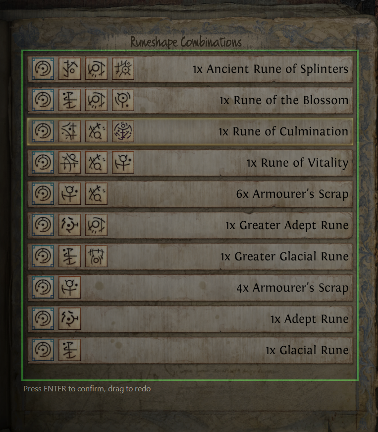

# Poe Ancients Price Helper

> Оверлей для **Path of Exile 2**, который в реальном времени показывает цены с [poe.ninja](https://poe.ninja) прямо поверх обменного камня. Поддерживает русский и английский клиенты.



---

## ⬇ Скачать

Перейди во вкладку **[Releases](../../releases/latest)** и скачай архив `PoeAncientsPriceHelper.zip` — распакуй в любую папку и запусти `PoeAncientsPriceHelper.exe`. Установка не нужна.

**Требования:** Windows 10/11 x64, [.NET 8 Desktop Runtime](https://dotnet.microsoft.com/download/dotnet/8.0)

---

## Быстрый старт

| Шаг | Действие |
|-----|----------|
| 1 | Запусти `PoeAncientsPriceHelper.exe` |
| 2 | Выбери лигу (`Runes of Aldur`) и язык игры (`rus` / `eng`) |
| 3 | Нажми **Calibrate Region** (или `F4`), обведи панель обмена в игре, подтверди `Enter` |
| 4 | Нажми **Start** (или `F5`) |
| 5 | Открой обменный камень — цены появятся рядом с названиями |



### Горячие клавиши

| Клавиша | Действие |
|---------|----------|
| `F5` | Старт / Стоп сканирования |
| `F4` | Калибровка региона |
| `F3` | Debug-оверлей |
| `Esc` | Скрыть оверлей |
| `Ctrl + ЛКМ` | Скрыть без закрытия панели |

> Все клавиши переназначаются кнопкой **Rebind** рядом с каждой.

### Трей

Сворачивание прячет окно в системный трей — сканирование продолжается. Двойной клик или `ПКМ → Show` восстанавливает. `ПКМ → Exit` или крестик завершают.

---

## Отличия от оригинала

Этот форк основан на [pedro-quiterio/PoeAncientsPriceHelper](https://github.com/pedro-quiterio/PoeAncientsPriceHelper).

### Поддержка русского языка

**Главное отличие от оригинала.** Оригинальный проект работает только с английским клиентом игры — русские названия предметов не распознаются вообще. В этом форке добавлена полноценная поддержка русского OCR (Tesseract `rus`), русская база имён предметов и настройка отображения языка в интерфейсе.

### Исправленные баги

#### Оверлей оставался на экране после ухода от камня
В оригинале нажатие `Esc` скрывало оверлей мгновенно, а просто отход персонажем оставлял его висеть долго. Причина: яркость пикселей игрового мира (~105 ед.) не опускалась ниже порога закрытия (80), и программа не понимала что панель закрыта.

**Исправление:** добавлен счётчик `zeroRowStreak` — если OCR возвращает 0 строк 5 раз подряд (~500 мс) пока панель «открыта», оверлей принудительно скрывается.

#### Короткие русские названия не получали цену
Предметы «Руна основ», «Руна славы» и другие с короткими именами не распознавались, хотя присутствовали в poe.ninja.

**Причина:** `NormalizeName` превращает `(1)` в ` 1` в конце строки. Для коротких имён (10 символов) это давало Levenshtein-score = 10/12 = **0.833** — ниже порога **0.84**. При этом чуть более длинные имена проходили (например «Руна охвата» — 11/13 = **0.846**, буквально на грани).

**Исправление:** `StripTrailingNoise` теперь удаляет завершающее число-количество, сохраняя числа уровней гемов (`uncut skill gem level 19` не трогается).

#### Утечка памяти в CalibrationOverlay
При каждом открытии калибровки создавался `Bitmap` всего виртуального рабочего стола (~150 МБ), который никогда не использовался.

**Исправление:** лишний захват экрана удалён.

#### Ошибки сборки
- Неоднозначность `ImageFormat` между `System.Drawing.Imaging` и `Tesseract` — исправлено
- Отсутствующий `app.manifest` (в репо был только `app.manifest.xml`) — добавлен

### Удалённое

| Что | Почему |
|-----|--------|
| Проверка обновлений через GitHub API | Форк не синхронизируется с оригиналом |
| Уведомление о новой версии | То же |
| Кнопка доната «Buy me a coffee» | Это форк — донат должен идти оригинальному автору |

---

## Сборка из исходников

```bash
git clone https://github.com/osadc/PoeAncientsPriceHelper
cd PoeAncientsPriceHelper/src/PoeAncientsPriceHelper
dotnet build -c Release
```

---

## Благодарности

Оригинальный проект: **[pedro-quiterio/PoeAncientsPriceHelper](https://github.com/pedro-quiterio/PoeAncientsPriceHelper)**  
Цены: **[poe.ninja](https://poe.ninja)**
